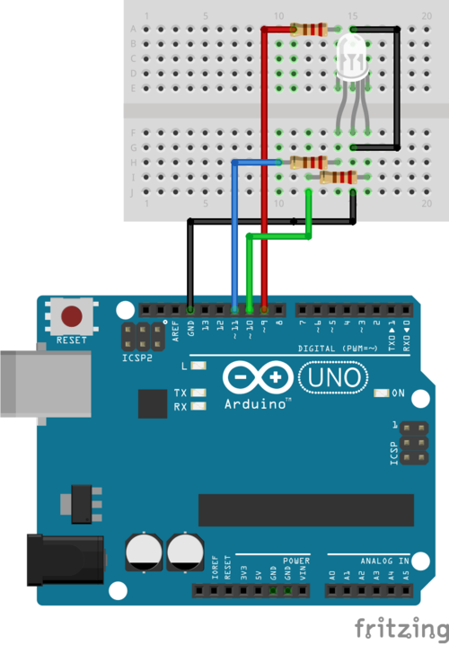
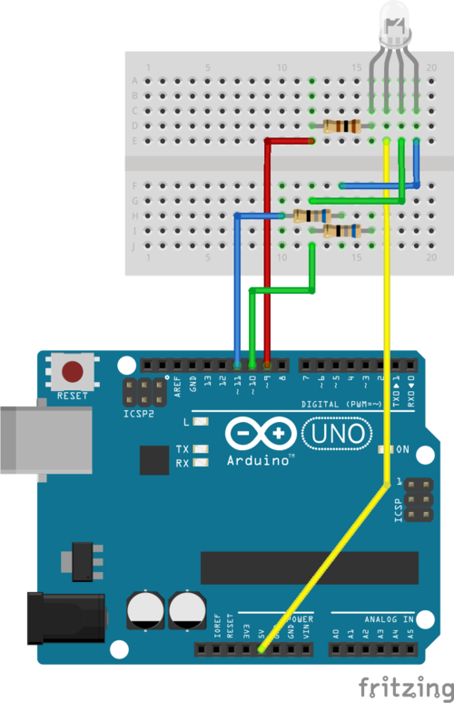

# lightwait-arduino

This is the code for an [Arduino](https://arduino.cc) based hardware device with one RBG LED which works as a [trigger](https://github.com/BuZZ-T/lightwait#trigger) in the [lightwait-stack](https://github.com/BuZZ-T/lightwait).

It both supports common-anode and common-cathode LEDs. Adapt `IS_COMMON_ANODE` in the code accordingly (See the [Pinouts](#pinouts)).

## Features

* Listening to receive messages in the [lightwait-tp](https://github.com/BuZZ-T/lightwait#transmitter---presenter) communication protocol via serial communication.
* Is currently tested on and supports the following [Arduino](https://arduino.cc)-based platforms
    * [Arduino Uno](https://store.arduino.cc/arduino-uno-rev3)
## Build

You can use different tools to build the .ino file. For example:

* The arduino IDE from [arduino.cc](https://www.arduino.cc/en/Main/Software)
* The  [Arduino Web Editor](https://create.arduino.cc/editor)
* The Sublime Text plugin for Arduino development [stino](https://github.com/Robot-Will/Stino)
* [ino](http://inotool.org/) 
    * `pip install ino`
    * `ino build`
* arduino-mk

## Flash

For a normal Arduino Uno, use this command to flash the previously compiled binary (adapt the device `/dev/ttyACM0` accordingly):
```bash
$ avrdude -patmega328p -carduino -P/dev/ttyACM0 -b115200 -D -Uflash:w:/path/to/lightwait.ino.hex:i
```

Alternatively, use tools which use `avrdude` internally, like the [Arduino IDE](https://www.arduino.cc/en/Main/Software), the [Arduino Web Editor](https://create.arduino.cc/editor) or editor plugins like stino for sublime.

## Test

### Serial connection in terminal

##### Set the correct configuration for the serial communication:
_(taken from here: https://playground.arduino.cc/Interfacing/LinuxTTY/)_

```
stty -F /dev/ttyACM0 cs8 9600 ignbrk -brkint -icrnl -imaxbel -opost -onlcr -isig -icanon -iexten -echo -echoe -echok -echoctl -echoke noflsh -ixon -crtscts
```

* Be sure to use the correct tty interface (here: `/dev/ttyACM0`)
* The baud rate is set to 9600 in the sketch, so this rate is also used here, adapt it here accordingly if you changed it in the sketch at `Serial.begin(9600)`

##### Send commands via echo
You can now send commands to the Arduino by piping the echo output to the tty interface:
```
echo "255:0:0" > /dev/ttyACM0
```
(Again, use the correct tty interface here)

<a name="pinouts"></a>
## Pinouts

There are two example pinouts, both for the Arduino UNO.

They also may contain an optional 10µF capasitor between RESET and GND to prevent resetting the arduino on establishing a new serial connection.  
Although this capasitor is optional, it has two advantages:

* The serial connection is established faster, making the color change apply faster
* A reset of the arduino implies a reset of all output pins, leading the LED to flicker to off before the color change applies.

**NOTE: Pay attention when using this capasitor when trying to upload new code to the arduino! We observed problems with the arduino programmer syncing with the capasitor attached, leading to a failing upload!**

### 6-pin common cathode LED

| Color | Arduino Pins | LED Pins 
|-|-|-|
| - | GND | 3/4 |
| red | 9 | 5 |
| green | 10 | 1 |
| blue | 11 | 2/6 |



### 4-pin common anode LED

| Color | Arduino Pins | LED Pins 
|-|-|-|
| - | 5V | 2 |
| red | 9 | 1 |
| green | 10 | 3 |
| blue | 11 | 4 |


